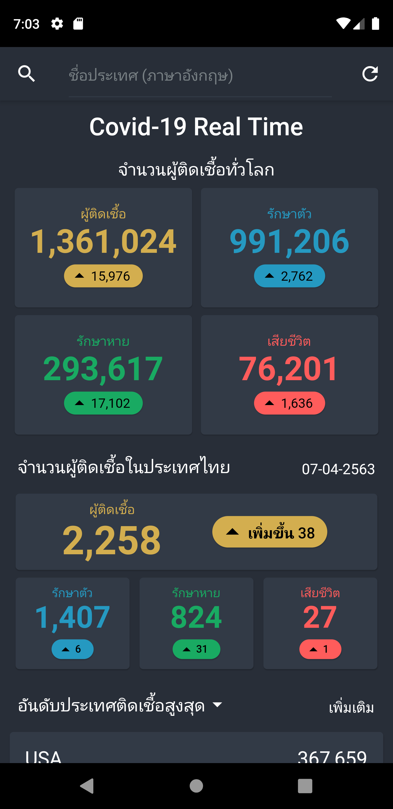
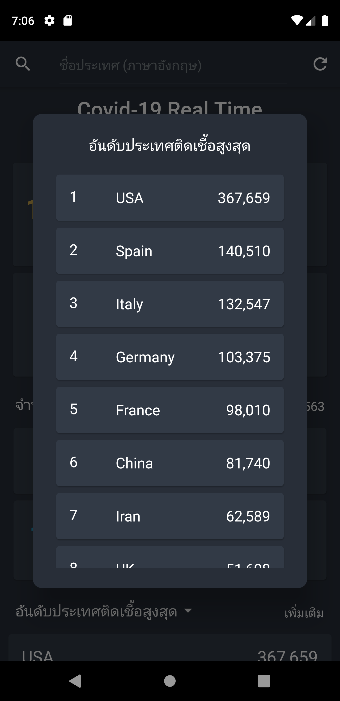

## Application for monitor COVID-19

**Application developed in Thailand langauge by Student of Thailand**

# Feature
- Global Status cases, active, recovered and deaths
- Thailand Status cases, active, recovered and deaths
- Ranking Status cases, active, recovered and deaths
- Search country cases, active, recovered and deaths

Thank you for api
`https://github.com/OssamaRafique/Corona-Statistics-And-Tracker-Dashboard-Angular-9`